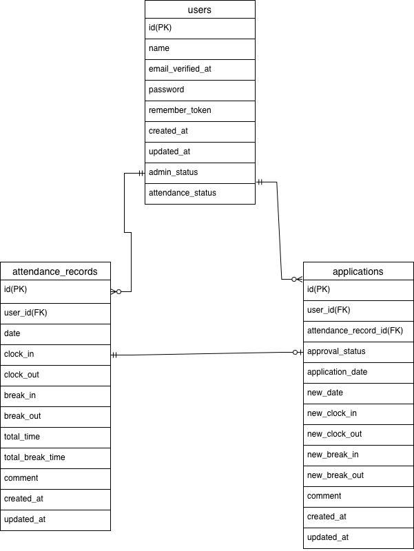

# 勤怠管理アプリ

## 環境構築

### Docker ビルド

- git clone https://github.com/Nagisa-byte/Mogianken2.git
- docker-compose up -d --build

### Laravel 環境構築

- docker-compose exec php bash
- composer install
- cp .env.example .env、環境変数を変更
- php artisan key:generate
- php artisan migrate
- php artisan db:seed

## 開発環境

- 勤怠登録画面：http://localhost/attendance
- ログイン画面（管理者）：http://localhost/admin/login
- phpMyAdmin：http://localhost:8080/

## 使用技術（実行環境）

- PHP8.1.33
- Laravel 8.83.29
- MySQL8.0.26
- nginx1.21.1
- MailHog latest

## ER 図

## ログイン情報
- 管理者：メールアドレス sample@sample.com  パスワード password
- ユーザー：メールアドレス sample1@sample.com パスワード password
## URL

- 開発環境：http://localhost/
- phpMyAdmin：http://localhost:8080
- MailHog：http://localhost:8025
